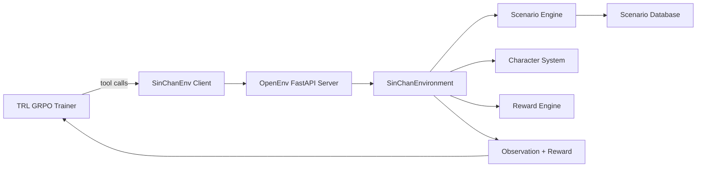

# ShinChan Life Simulator

**Meta OpenEnv Hackathon Grand Finale Submission**

ShinChan Life Simulator is an OpenEnv-compliant RL environment where an agent plays as Shin-chan Nohara through multi-step social/family/school dilemmas. The model learns to improve decision quality while preserving Shin-chan's chaotic-but-caring personality.

## Why This Matters

- **Personalized decisions:** Balances competing constraints (Mom, friends, duty, temptation).
- **Theory of mind:** Rewards understanding of how actions affect different characters.
- **Self-improvement:** Curriculum-based difficulty progression enables learning from mistakes.
- **Personality-preserving alignment:** Better behavior without turning Shin-chan into a bland assistant.

## Core Features

- Multi-turn episodes with branching narratives and NPC reactions
- Relationship meters across recurring characters (Misae, Hiroshi, Kazama, Nene, etc.)
- Multi-component reward engine (decision quality, social awareness, responsibility, personality, creativity, long-term thinking)
- Curriculum by scenario difficulty
- OpenEnv server + MCP tool interface

## Project Structure

```text
sinchan_env/
├── __init__.py
├── client.py
├── models.py
├── Dockerfile
├── openenv.yaml
├── server/
│   ├── app.py
│   ├── characters.py
│   ├── scenario_data.py
│   ├── scenarios.py
│   ├── reward_engine.py
│   ├── sinchan_environment.py
│   ├── Dockerfile
│   └── requirements.txt
├── training/
│   ├── train_sinchan.py
│   ├── preflight_space.py
│   └── ShinChan_GRPO_Training.ipynb
└── tests/
    └── test_smoke.py
```

## Architecture



## Quick Start (Local)

### 1) Install and Run

```bash
pip install -e .
uv run server
```

Open `http://localhost:8000/web`.

### 2) Smoke Tests

```bash
python -m pytest -q tests/test_smoke.py
```

### 3) Client example (local)

```python
from sinchan_env import SinChanEnv

with SinChanEnv(base_url="http://localhost:8000") as env:
    env.reset()
    info = env.call_tool("get_scenario_info")
    print(info["title"])

    result = env.call_tool(
        "choose_action",
        action_name=info["available_actions"][0]["name"],
        reasoning="I should think about tomorrow and others' feelings.",
        dialogue="Buri buri~ I'll do the right thing my way!",
    )
    print(result)
```

### 4) Hugging Face Space (canonical: HTTP MCP)

For `https://YOUR-SPACE.hf.space`, this project’s client **defaults to HTTP MCP** (no WebSocket) for `https` URLs, which is more reliable on hosted Spaces than raw `/ws` traffic.

```python
from sinchan_env import CallToolAction, SinChanEnv

# prefer_http_mcp=True is the default for https:// bases
with SinChanEnv(
    base_url="https://YOUR-SPACE.hf.space",
    prefer_http_mcp=True,
) as env:
    env.reset()
    step_result = env.step(
        CallToolAction(
            tool_name="get_scenario_info",
            arguments={},
        )
    )
    print(step_result.observation)
```

Do **not** copy Playground text that uses `CallToolAction(message=...)` or `from openenv import CallToolEnv` unless you know that matches your installed `openenv-core`. This repo exports `SinChanEnv` / `CallToolEnv` from `sinchan_env` (see [client.py](client.py)).

**Check the live Space (health + reset + /mcp) before training:**

```bash
python training/preflight_space.py --base-url https://YOUR-SPACE.hf.space --retries 3
```

See [RUNBOOK.md](RUNBOOK.md) for A/B/C/D triage, Colab copy-paste checks, and deploy alignment.

## Deploy to Hugging Face Spaces

```bash
openenv push --repo-id YOUR_USERNAME/sinchan-env .
```

If you upload the repo directly to Hugging Face Spaces, keep the root `Dockerfile` in place. OpenEnv will also use it when staging a deployment.

## Training

Use either:
- `training/train_sinchan.py`
- `training/ShinChan_GRPO_Training.ipynb` (Colab)

Set the environment URL before training. On PowerShell:

```bash
$env:ENV_URL = "https://YOUR-SPACE.hf.space"
```

Example configurable run:

```bash
python training/train_sinchan.py --env-url $env:ENV_URL --max-steps 200 --output-dir training/artifacts/run1
```

If you are using `cmd.exe`, replace `$env:ENV_URL` with `%ENV_URL%`.

## Evaluation and Evidence

Generate baseline comparison JSON:

```bash
python training/evaluate_scenarios.py --env-url $env:ENV_URL --episodes 10 --output training/artifacts/eval_summary.json
```

### Reward Curves

Add generated images to `assets/` and link them here:
- `assets/reward_curve_total.png`
- `assets/reward_curve_components.png`
- `assets/loss_curve.png` (optional)

### Before vs After (Same Scenarios)

| Scenario | Before Training | After Training |
|---|---|---|
| Last Chocobi | [TODO] | [TODO] |
| Homework Dilemma | [TODO] | [TODO] |
| Broken Window Trouble | [TODO] | [TODO] |
| Teacher in Tears | [TODO] | [TODO] |
| Candy from a Stranger | [TODO] | [TODO] |

### Example Behavioral Shift

- **Before:** impulsive/selfish actions, generic reasoning, weak character voice.
- **After:** consequence-aware choices, stronger social awareness, Shin-chan style preserved.

## Submission Links

- Hugging Face Space: `[ADD LINK]`
- Colab Notebook: `[ADD LINK]`
- Repository: `[ADD LINK]`
- Demo Video / Blog: `[ADD LINK]`

## Hackathon Checklist

- [x] OpenEnv server with reset/step/state flow
- [x] Scenario engine + multi-dimensional rewards
- [x] Client-server separation
- [x] Dockerized deployment path
- [x] 30+ scenarios
- [ ] Reward plots committed
- [ ] Before/after comparison committed
- [ ] Final public links added
